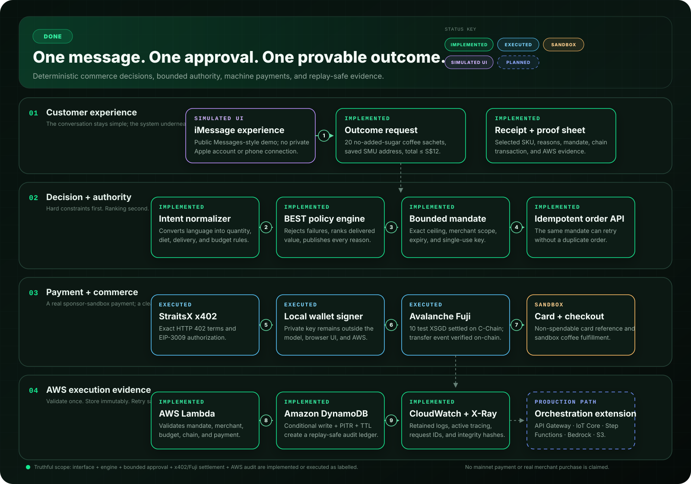

# DONE

> **Don’t buy products. Buy outcomes.**

[Run the live demo](https://done-agentic-commerce.vercel.app/) · [Inspect the Fuji transaction](https://testnet.snowtrace.io/tx/0x920f3ee1e61ec5cfac585a86aaf1261dbcc7bab1ec1587e449bac86fd2031335)

DONE is a bounded autonomous-commerce agent for Singapore. A customer describes an outcome in ordinary language, approves one precise spending ceiling, and receives a completed sandbox order with an inspectable decision trail, payment proof, and replay-safe AWS audit record.

The one-minute scenario is deliberately ordinary:

> “Find me 20 sachets of no-added-sugar coffee, deliver them to my saved SMU address, and keep the total under S$12.”

DONE filters unsuitable products, ranks the eligible choices using a public policy, asks once for permission to spend up to S$12, creates the order exactly once, and leaves the final proof open for inspection.

## Why it matters

Most shopping assistants stop at recommendations or hand users to a checkout page. DONE demonstrates the missing trust layer between **intent** and **execution**:

- Constraints are machine-checkable and never silently relaxed.
- “Best” is deterministic, explainable, and published in [`BEST.md`](public/BEST.md).
- Authority is narrow: one use, one merchant scope, one ceiling, one expiry.
- Payment evidence is public and independently verifiable.
- Retries cannot silently produce duplicate orders.
- Secrets and sensitive delivery data stay outside the model and public interface.

## Architecture

[](docs/architecture.svg)

GitHub renders the SVG above directly. The editable submission source remains available as [`architecture.drawio`](architecture.drawio).

### End-to-end flow

1. **Ask** — the customer describes the desired outcome, constraints, delivery scope, and budget.
2. **Normalize** — the request becomes structured purchase intent.
3. **Decide** — hard requirements remove unsafe or invalid candidates; `DONE-BEST-v1` ranks the rest.
4. **Approve** — the customer explicitly authorizes a single-use spending mandate.
5. **Challenge** — StraitsX returns exact HTTP 402 payment terms.
6. **Sign** — the EIP-3009 authorization is signed at the local wallet boundary.
7. **Settle** — 10 test XSGD settles on Avalanche Fuji C-Chain.
8. **Execute** — the merchant sandbox creates the selected coffee order once.
9. **Prove** — AWS validates and stores sanitized evidence; the UI exposes the receipt, policy reasons, transaction, and replay result.

## What actually ran

Truthful status labels are part of the product—not footnotes.

| Capability | Status | Verifiable evidence |
|---|---|---|
| Messages-style customer journey | **Simulated UI** | [Live demo](https://done-agentic-commerce.vercel.app/) opens with an explicit simulation notice |
| Intent, constraints, BEST ranking, approval, receipt | **Implemented** | [`lib/commerce`](lib/commerce) and the live demo |
| Duplicate-order protection | **Implemented** | [`POST /api/orders`](app/api/orders/route.ts) returns the original order on replay |
| HTTP 402 + EIP-3009 authorization | **Executed** in sponsor sandbox | [`phase3-proof.json`](public/phase3-proof.json) |
| 10 test XSGD on Avalanche Fuji | **Confirmed on-chain** | [Snowtrace transaction](https://testnet.snowtrace.io/tx/0x920f3ee1e61ec5cfac585a86aaf1261dbcc7bab1ec1587e449bac86fd2031335) |
| Card capability and merchant checkout | **Sandbox** | Non-spendable card reference and sandbox coffee order |
| Lambda validation + DynamoDB replay test | **Executed on AWS** | [`phase4-proof.json`](public/phase4-proof.json) |
| CloudWatch logs + active X-Ray tracing | **Implemented on AWS** | Sanitized execution IDs and configuration in [`phase4-proof.json`](public/phase4-proof.json) |
| Native iMessage transport and broader AWS orchestration | **Production direction** | Shown separately as planned in the diagram |

No real merchant purchase or mainnet payment is claimed. The 30 mainnet XSGD allocation was not submitted to this demo flow.

## How “best” is defined

The decision rule is intentionally merchant-agnostic:

> Reject anything that violates the request or spending mandate; rank the remaining options by match, delivered value, quality, and delivery speed.

| Stage | Rule |
|---|---|
| Eligibility | In stock, deliverable to the requested region, all explicit constraints matched, and delivered total within the approved ceiling |
| Constraint match | 55 points |
| Delivered value | 20 points |
| Merchant/product quality | 15 points |
| Delivery speed | 10 points |
| Tie-break | Lower delivered total, then stable product ID |

Missing or ambiguous price data is never eligible for autonomous purchase. Every rejection reason is retained for inspection.

## Trust and security model

The model can propose and explain; it cannot expand its own authority.

| Control | Invariant |
|---|---|
| Wallet custody | Private keys never enter the model, public UI, repository, or AWS |
| Payment authority | Amount, merchant scope, delivery label, expiry, and single-use intent are bound before signing |
| Sensitive data | Card PAN/CVV, OTPs, Apple credentials, and full delivery addresses never appear in public proof |
| Order safety | A stable idempotency key returns the original result on replay |
| Audit integrity | AWS validates the evidence envelope and stores a hash-linked, encrypted record |
| Demo honesty | Simulated, sandboxed, executed, implemented, and planned components are visibly distinguished |

## System components

| Boundary | Responsibility | Key implementation |
|---|---|---|
| Experience | Request, bounded approval, receipt, proof viewer | Next.js 16, React 19, Vercel |
| Decision | Intent schema, catalog evaluation, deterministic policy | [`lib/commerce`](lib/commerce), [`/api/policy`](app/api/policy/route.ts) |
| Execution | Single-use mandate and idempotent order creation | [`/api/orders`](app/api/orders/route.ts) |
| Payment | Machine-readable payment request and authorization | StraitsX x402, EIP-3009 |
| Settlement | Test-XSGD transfer and public finality | Avalanche Fuji C-Chain, chain ID `43113` |
| Audit | Evidence validation, conditional persistence, observability | AWS Lambda, DynamoDB, CloudWatch, X-Ray |

## Run locally

Requires Node.js **22.13 or newer**.

```bash
git clone https://github.com/13shreyansh/done-agentic-commerce.git
cd done-agentic-commerce
npm install
npm run dev
```

Open `http://localhost:3000`. Choose **Play full demo** for the timed judge flow, or interact with the request and approval manually.

### Validate the build

```bash
npm run lint
npm test
```

### Inspect the policy API

```bash
curl http://localhost:3000/api/policy
curl 'http://localhost:3000/api/policy?format=md'
```

### Exercise idempotency

```bash
curl -i -X POST http://localhost:3000/api/orders \
  -H 'content-type: application/json' \
  --data '{
    "intent": {
      "rawRequest": "Find 20 no-added-sugar coffee sachets under S$12",
      "quantity": 20,
      "noAddedSugar": true,
      "deliveryAddressLabel": "Saved SMU address",
      "deliveryRegion": "SG",
      "maxTotalSgd": 12
    },
    "approval": {
      "approved": true,
      "approvalText": "Approved up to S$12",
      "maxSpendSgd": 12
    },
    "idempotencyKey": "done-readme-demo-001"
  }'
```

Repeat the same request: the response includes `X-Idempotent-Replay: true` and returns the first order rather than creating another.

## Award fit

- **AI Commerce Agents** — natural-language intent becomes a resolved SKU, delivered price, bounded approval, and completed outcome.
- **StraitsX Real-World Impact** — Singapore-dollar-native everyday commerce becomes auditable without exposing wallet or card secrets.
- **Best Use of x402 on Avalanche** — the project executed an exact HTTP 402 request, signed an EIP-3009 authorization, and settled test XSGD on Fuji.
- **AWS Best Architected** — Lambda validates the trust boundary; DynamoDB conditional writes provide idempotency; encryption, PITR, TTL, least-privilege IAM, CloudWatch, and X-Ray make the execution recoverable and observable.

## Repository guide

```text
app/                       Product experience and API routes
lib/commerce/              Intent types, catalog, BEST policy, engine, store
lib/payments/              Public-safe payment proof types and validation
public/BEST.md             Human-readable autonomous-selection policy
public/phase3-proof.json   Sanitized x402 + Avalanche execution proof
public/phase4-proof.json   Sanitized AWS execution and replay proof
docs/architecture.svg      GitHub-rendered architecture diagram
architecture.drawio        Editable architecture source
```

## Agent handoff contract

Coding agents working on this repository should preserve these invariants:

1. The main demo request has a **S$12 ceiling**; the selected delivered total is **S$10**.
2. Purchase execution requires explicit approval whose ceiling exactly matches the intent.
3. Hard constraints may never be silently weakened to produce a result.
4. A repeated idempotency key must never create a second order.
5. Public output must never contain private keys, card secrets, OTPs, Apple credentials, or full addresses.
6. The merchant order and card remain labelled **sandbox** until a real merchant integration exists.
7. The public Messages experience remains labelled **simulated** until native transport is connected.
8. `architecture.drawio` is the editable source; `docs/architecture.svg` is the GitHub-rendered companion and both must stay truthful.

## Evidence index

- [Live product](https://done-agentic-commerce.vercel.app/)
- [Rendered architecture](docs/architecture.svg)
- [Editable Draw.io architecture](architecture.drawio)
- [Public BEST policy](public/BEST.md)
- [x402/Avalanche proof](public/phase3-proof.json)
- [AWS proof](public/phase4-proof.json)
- [Snowtrace transaction](https://testnet.snowtrace.io/tx/0x920f3ee1e61ec5cfac585a86aaf1261dbcc7bab1ec1587e449bac86fd2031335)

Built at **Agentix Playground** by team **DONE**.
