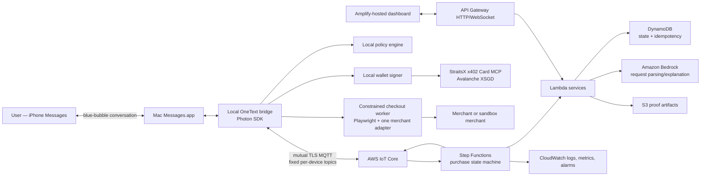

# Agentix OneText — superseded implementation research

> **NON-AUTHORITATIVE:** This document is retained for historical research. [PRD.md](PRD.md) is the sole source of truth for DONE. If this document conflicts with the PRD, the PRD wins.

Status: archived prior design. Do not implement it directly; use `PRD.md`.

This document separates three kinds of statements:

- **Verified** — observed locally, returned by the live event endpoint, shown in the organizer slides, or documented by the primary vendor/source.
- **Design decision** — the architecture we will implement.
- **Open dependency** — something that must be tested or supplied before we can honestly claim it works.

## 1. Product decision

Build **Agentix OneText**, a bounded autonomous shopping agent operated from the real Apple Messages app.

The one-line pitch is:

> Text what you need, approve one precise spending envelope, and receive the best eligible option plus an auditable purchase receipt—without exposing your wallet or card to the AI.

The demo user sends a request from an iPhone. A Mac Messages bridge receives it, the agent compiles a purchase mandate, compares supported inventory using `PURCHASE_POLICY.md`, and replies in the same blue-bubble conversation. The user sends one approval. The system then demonstrates XSGD/x402 card issuance, checkout, and a receipt, with a live AWS-hosted proof dashboard.

### Track and prizes

Primary track: **AI Commerce Agents**.

Prize alignment:

1. **Track 1** — natural-language discovery, comparison, bounded approval, and purchase.
2. **StraitsX Real-World Impact Award** — a nontechnical user can make an everyday SGD-denominated purchase with explicit limits and a plain-language audit trail.
3. **Avalanche Best Use of x402** — the product performs the actual HTTP 402 challenge, EIP-3009 authorization, XSGD settlement, and retry; x402 is not decorative.
4. **AWS Best Architected Solution** — AWS hosts the state machine, evidence, dashboard, observability, and secure command channel while the sensitive signer and Messages bridge stay on the user's Mac.

## 2. Truth boundary

### Verified today

- The submitted wallet `0x701cBCd4cD9e1F49178c1cc2E62504d9122E032A` has been observed with:
  - 0.2 AVAX and 30 XSGD on Avalanche C-Chain mainnet;
  - approximately 0.501 test AVAX and 380 test XSGD on Fuji.
- The event Card MCP sandbox is reachable at `https://card.straitsx.ai/sandbox/sse`.
- Its card issuance tool accepts S$5–S$30 and returns an x402-protected card endpoint.
- A live unsigned request to that endpoint returned HTTP 402 and specified:
  - Fuji chain ID `43113`;
  - XSGD contract `0xd769410dc8772695a7f55a304d2125320a65c2a5`;
  - `exact` payment of 5,000,000 atomic units (5 test XSGD);
  - EIP-3009 transfer authorization;
  - a 300-second authorization window;
  - x402 protocol version 1 for this event endpoint.
- The card returned by the sandbox is a sandbox virtual Visa and cannot make a real-money purchase.
- The organizer slides require XSGD on Avalanche C-Chain mainnet and list the four payment-lifecycle milestones: funding, discovery, card issuance, and execution.
- This Mac is Apple Silicon on macOS 26.5.2.
- Its local Messages database exists, is readable by the current process, and contains iMessage history. Messages.app was not running during the audit.
- Photon `@photon-ai/imessage-kit` documents macOS 26 support, reads `chat.db`, watches messages, and sends through Messages.app using AppleScript. Multiple recent public hackathon entries report using Photon or the same local-Mac bridge pattern.
- The AWS CLI is installed. The event AWS SSO profile is not currently authenticated/configured with a usable account and role.

### Open dependencies—do not claim these until tested

- A production StraitsX Card MCP endpoint, production-card eligibility, merchant restrictions, and any whitelist/KYC requirement have not been supplied or verified.
- The sandbox card cannot prove a real merchant charge.
- A specific real merchant/SKU has not been successfully charged with the event card. Guest checkout, delivery price, CAPTCHA, 3DS, and issuer acceptance must be preflighted.
- The Mac's current Messages account/identity and the separate bot recipient have not been validated end to end.
- Amazon Bedrock model access in the temporary event AWS account and chosen region is not yet verified.
- Mainnet x402/card issuance behavior is not inferred from the Fuji sandbox. It needs organizer documentation or a production challenge response.

## 3. Demo contract

The demo must be repeatable and honest. It has two modes behind the same interfaces.

### Mode A — guaranteed hackathon sandbox path

- Real iPhone-to-Mac iMessage conversation.
- Real catalog search and deterministic comparison over a supported catalog.
- Real user approval in Messages.
- Real Fuji HTTP 402 response, EIP-3009 signature, test-XSGD settlement, and sandbox card issuance.
- Deterministic sandbox merchant checkout and receipt.
- AWS-hosted live state/proof dashboard.

Narration must say **sandbox card** and **Fuji test XSGD**. It must not say a real product was purchased.

### Mode B — production path, enabled only after preflight

- Same flow, but production Card MCP and a qualified guest-checkout merchant.
- Mainnet XSGD and a real merchant order.
- Enabled only after a low-value controlled charge and refund/void behavior are understood.

If production access is not available, Mode A remains a complete technical demonstration and the mainnet balance is shown as production readiness—not falsely presented as settlement.

## 4. User experience

### Canonical conversation

```text
User:
Buy the best useful USB-C cable under S$15 delivered to Home.
One order, no substitutions. Prefer durability over speed.

OneText:
I checked 8 options. 3 met every rule.

Best: [exact item] — S$12.40 delivered
Why: correct connector + strongest warranty; S$1.20 more than the
cheapest eligible option. Delivery: tomorrow.

Approve one order up to S$12.40 at [merchant], expires in 10 min?
Reply: APPROVE 4821

User:
APPROVE 4821

OneText:
Approved. Issuing a one-use card and placing the order…

OneText:
Purchased ✓
Order: SG-10428
Final: S$12.40
XSGD settlement: 0x…
Decision proof: https://…/p/01J…
```

The exact product and cap are launch configuration, not hard-coded product logic. A candidate SKU is accepted only after the merchant preflight in section 15.

### What “best” means

The running application loads `docs/PURCHASE_POLICY.md`. It does not rely on an unrecorded model opinion.

1. Compile the message into hard constraints, objective, ordered preferences, destination alias, amount cap, order count, substitution rule, and expiry.
2. Reject candidates with missing or contradictory critical evidence.
3. Rank survivors lexicographically:
   - user's explicit objective;
   - user's ordered preferences;
   - versioned category rubric;
   - risk-adjusted total cost;
   - acceptable fulfilment speed;
   - transaction confidence;
   - stable URL tie-breaker.
4. Show candidates, rejections, evidence, policy version, and exact winning comparison in the proof page.

The model may parse or explain. Deterministic code validates constraints and calculates the final ranking.

### Approval semantics

`APPROVE 4821` authorizes exactly one canonical mandate:

- one SKU;
- one merchant;
- one destination alias;
- an exact final amount or maximum amount;
- one order;
- no substitution unless explicitly present;
- a short expiry;
- a single-use nonce.

Any change in item, merchant, destination, final total, subscription status, or challenge invalidates the approval and pauses the workflow.

## 5. Architecture



### Why the Mac stays in the architecture

- Apple does not provide the public inbound blue-bubble bot webhook needed for this prototype.
- The local bridge needs access to the user's `chat.db` and Messages.app automation.
- The wallet private key, Messages database, browser profile, card fields, OTP, and delivery address stay local.
- AWS sends work over an outbound, mutually authenticated IoT connection. No public inbound port or tunnel is required on the Mac.

### Production channel path

The hackathon bridge is a prototype transport. A commercial deployment should replace it with a supported customer channel such as Apple Messages for Business, SMS, WhatsApp, Telegram, or an in-app chat while retaining the same purchase state machine and policy engine.

## 6. Purchase state machine

```text
RECEIVED
  -> AUTHORIZED_SENDER?
  -> PARSE_MANDATE
  -> VALIDATE_MANDATE
  -> SEARCH
  -> NORMALIZE_EVIDENCE
  -> APPLY_ELIGIBILITY_GATE
  -> RANK
  -> QUOTE
  -> AWAIT_APPROVAL
  -> VALIDATE_APPROVAL_NONCE
  -> REQUOTE
  -> AUTHORIZE_X402
  -> ISSUE_ONE_USE_CARD
  -> EXECUTE_CHECKOUT
  -> VERIFY_MERCHANT_RECEIPT
  -> BUILD_DECISION_PROOF
  -> COMPLETE
```

Terminal alternatives:

- `NEEDS_CLARIFICATION`
- `NO_ELIGIBLE_OPTIONS`
- `EXPIRED`
- `PRICE_CHANGED`
- `HUMAN_REQUIRED` for CAPTCHA, OTP, 3DS, login, or ambiguous checkout
- `PAYMENT_FAILED`
- `CHECKOUT_FAILED`
- `CANCELLED`

Step Functions owns transitions and retry policy. It never owns payment secrets.

## 7. Component specifications

### 7.1 Local Messages bridge

Technology: Node 22 + TypeScript + `@photon-ai/imessage-kit`.

Responsibilities:

- watch direct inbound messages;
- accept only an allowlisted sender and exact direct-chat ID;
- ignore `isFromMe` messages;
- write each message GUID into an idempotency store before processing;
- normalize text and attachments into a command envelope;
- publish command events to AWS IoT Core;
- send progress, approval request, failure, and receipt replies;
- correlate outgoing sends with an observed `from-me` row before marking delivery attempted;
- persist an encrypted local cursor so restarts do not replay old messages.

Required setup:

- Messages.app logged into a bot identity that the demo iPhone can message;
- preferably a bot Apple ID/iMessage address distinct from the user's sender identity;
- Messages.app running during the demo;
- Full Disk Access for the daemon's parent process;
- Automation permission to control Messages;
- a one-on-one chat selected and frozen for the demo.

Do not use group chat, tapbacks, editing, private frameworks, or a SIP-disabled helper in the critical path.

### 7.2 Local command envelope

```ts
type InboundCommand = {
  schemaVersion: "1";
  messageGuid: string;
  chatIdHash: string;
  senderHash: string;
  receivedAt: string;
  text: string;
  attachmentRefs: string[];
  deviceId: string;
};
```

Raw phone numbers and chat IDs are never used as MQTT topic names and are not shown on the public dashboard.

### 7.3 Mandate

```ts
type PurchaseMandate = {
  id: string;
  requestText: string;
  category: string;
  quantity: number;
  destinationAlias: string;
  mustHave: string[];
  mustNotHave: string[];
  maximumDeliveredTotalMinor: number;
  currency: "SGD";
  primaryObjective: string;
  orderedPreferences: string[];
  allowedMerchantIds: string[];
  substitutionsAllowed: boolean;
  maximumOrders: 1;
  expiresAt: string;
  policyVersion: "1.0";
};
```

The cloud sees `destinationAlias`, not the street address. The local checkout worker resolves the alias.

### 7.4 Catalog/search adapter

Critical path: one deterministic adapter for one qualified Shopify/merchant flow or a controlled sandbox merchant.

Interface:

```ts
interface MerchantAdapter {
  search(mandate: PurchaseMandate): Promise<Candidate[]>;
  quote(candidate: Candidate, destinationAlias: string): Promise<FinalQuote>;
  checkout(intent: PaymentIntent): Promise<MerchantReceipt>;
}
```

Every candidate carries source URL, source timestamp, SKU, stock, seller, item price, mandatory fees, shipping, tax, delivery estimate, returns, confidence, and evidence snippets.

Do not place an open-ended browser-use agent in the payment path. Browser reasoning can discover candidates, but only a versioned adapter may click the final checkout buttons.

### 7.5 Bedrock agent role

Use Amazon Bedrock Converse with a strict tool schema if a suitable model is enabled in the event account.

Allowed duties:

- convert natural language into the typed mandate;
- identify ambiguity and propose one clarification;
- extract normalized attributes from untrusted catalog text;
- produce the short human-readable comparison explanation.

Forbidden duties:

- signing transactions;
- reading wallet, card, browser-login, OTP, or delivery-address secrets;
- changing the policy or ranking result;
- clicking final purchase controls;
- treating merchant text as instructions.

Every Bedrock output is schema-validated and then checked by deterministic policy code. If Bedrock access is unavailable, a deterministic parser plus fixed demo prompts is the fallback; the architecture must not fail closed because a specific model is missing.

### 7.6 Approval service

The quote response generates:

- six-character human approval code;
- 128-bit random nonce;
- canonical mandate hash;
- exact displayed quote hash;
- chat/sender binding;
- 10-minute TTL;
- `unused` status.

The approval message must match sender, chat, code, mandate hash, quote hash, TTL, and unused nonce. DynamoDB conditional update changes `unused -> consumed` once. Duplicate Messages events return the previously stored result.

### 7.7 Wallet signer and x402 adapter

The signer is a separate local process with a narrow JSON-RPC/Unix-socket API. It loads the encrypted wallet only for signing and zeroizes process memory on exit where the runtime permits.

Before signing, it independently enforces:

- correct chain ID;
- exact XSGD contract allowlist;
- `payTo` allowlist or organizer-supplied endpoint binding;
- amount no greater than the approved quote;
- EIP-3009 method only;
- fresh random nonce;
- short `validAfter`/`validBefore` interval;
- payment challenge bound to the current purchase ID;
- no blind transaction or unlimited token allowance.

Protocol adapter:

```ts
interface CardIssuer {
  getChallenge(input: CardRequest): Promise<X402Challenge>;
  signChallenge(challenge: X402Challenge, approval: Approval): Promise<string>;
  submit(input: CardRequest, paymentHeader: string): Promise<CardHandle>;
}
```

The event sandbox currently speaks x402 v1. Current public x402 documentation describes newer forms too, so protocol version stays behind this interface instead of being spread through the app.

### 7.8 Card broker

- Store only an opaque card handle and non-sensitive metadata.
- Never put PAN, CVV, expiry, OTP, or rendered card HTML into Bedrock, DynamoDB, S3, logs, screenshots, traces, or public proof pages.
- If the event endpoint returns a one-time iframe, render it only in a local isolated context.
- Destroy the browser context immediately after checkout.
- A reusable credential, if ever added, must be a provider token in a PCI-scoped vault; hashing a PAN is not credential security.

### 7.9 Checkout worker

Technology: local Playwright with a single, explicitly supported merchant adapter.

Controls:

- new incognito context per purchase;
- fixed merchant-origin allowlist;
- block navigation to unexpected origins except required payment-provider origins;
- no saved cookies or passwords in the demo path;
- verify SKU, quantity, merchant, destination, and final delivered total immediately before clicking Pay;
- stop on CAPTCHA, OTP, 3DS, login, pop-up terms, subscription, tip, donation, or price change;
- record only sanitized screenshots and DOM evidence;
- require a merchant confirmation/reference before declaring success;
- destroy context after success/failure.

It does not solve or bypass CAPTCHA. That is an explicit human-required terminal state.

### 7.10 Proof service

Produce canonical JSON containing:

- original request;
- mandate and policy version;
- candidate evidence and timestamps;
- rejection reasons;
- winner comparison;
- approval envelope and expiry (no secret nonce);
- final quote;
- XSGD settlement transaction/reference;
- merchant order reference;
- final total;
- state-transition timestamps;
- sanitized failure/retry events.

Hashes:

```text
mandate_hash  = SHA-256(canonical_json(mandate))
decision_hash = SHA-256(canonical_json(mandate_hash, candidates, winner, quote))
receipt_hash  = SHA-256(canonical_json(decision_hash, settlement_ref, order_ref))
```

Sign the receipt hash with a service signing key. Hashes prove integrity; they do not conceal payment credentials.

## 8. AWS service map

| Need | AWS service | Reason |
|---|---|---|
| Hosted judge-facing frontend | Amplify Hosting | Fast Git/manual deployment and managed CDN |
| REST endpoints | API Gateway HTTP API + Lambda | Small serverless surface |
| Live dashboard updates | API Gateway WebSocket API | Server-pushed workflow events |
| Durable orchestration | Step Functions Standard | Visible state machine, retries, catches, and audit history |
| Purchase/idempotency state | DynamoDB | Conditional writes and low-ops persistence |
| Model parsing/explanation | Amazon Bedrock Converse | Structured tool use without giving the model execution authority |
| Mac command/event channel | AWS IoT Core MQTT | Outbound mutual-TLS device connection and per-topic policy |
| Sanitized proof artifacts | S3 | Durable object storage |
| Logs/metrics/alarms | CloudWatch | Operations and demo telemetry |
| API secrets/signing keys | Secrets Manager + KMS | Managed encryption and rotation boundary |
| Infrastructure as code | AWS CDK in TypeScript | Reproducible architecture in the repository |

### IoT topics and policy

```text
agentix/<device-id>/commands
agentix/<device-id>/events
agentix/<device-id>/health
```

The Mac certificate can connect only as its exact client ID, subscribe only to its `commands` topic, and publish only to its `events` and `health` topics. No wildcards in the device policy.

### Well-Architected mapping

- **Operational excellence:** CDK, state-machine visibility, structured logs, runbook, one-command smoke test.
- **Security:** local custody, least-privilege IoT identity, KMS/Secrets Manager, secret redaction, bounded approval, exact EIP-3009 authorization.
- **Reliability:** conditional idempotency, retries with backoff, explicit terminal states, immutable result replay, merchant preflight.
- **Performance efficiency:** Lambda/Step Functions for bursty work; WebSocket push; catalog cache with freshness timestamp.
- **Cost optimization:** serverless services, TTLs, bounded logs, one Bedrock parse and one explanation per purchase.
- **Sustainability:** no always-on cloud server; local daemon and event-driven managed services only when used.

## 9. Data model

### DynamoDB single-table keys

```text
PK PURCHASE#<purchase-id>  SK META
PK PURCHASE#<purchase-id>  SK EVENT#<timestamp>#<event-id>
PK PURCHASE#<purchase-id>  SK CANDIDATE#<candidate-id>
PK PURCHASE#<purchase-id>  SK APPROVAL
PK MESSAGE#<message-guid>   SK RESULT
PK DEVICE#<device-id>       SK HEALTH
```

Sensitive values are excluded. TTL removes message/idempotency records after the configured audit period; public proof artifacts are separately sanitized.

## 10. Public dashboard specification

The dashboard is not a second shopping interface. Messages is the customer interface; the dashboard is the judge/audit interface.

### Screens

1. **Landing / Start**
   - one-line pitch;
   - live system readiness badges: Messages bridge, AWS, Fuji/mainnet wallet, Card MCP;
   - QR/deep link that opens the bot conversation;
   - “Try the demo prompt” card.
2. **Live Run**
   - horizontal state timeline;
   - original request and compiled mandate;
   - candidates with pass/fail evidence;
   - deterministic winner comparison;
   - approval envelope;
   - x402 challenge → signature → settlement sequence;
   - checkout status and receipt.
3. **Decision Proof**
   - immutable read-only proof;
   - policy/rubric versions;
   - Snowtrace settlement link;
   - receipt and hashes;
   - secret-safety statement.
4. **Architecture**
   - rendered system diagram;
   - AWS service mapping;
   - six Well-Architected pillars;
   - sandbox/production truth label.

### Visual style

- deep charcoal background, StraitsX green as success/payment accent, Avalanche red only for chain markers, AWS orange only for cloud markers;
- large 60-second-demo typography;
- state colors: neutral, active, success, human-required, failure;
- no fake terminal rain or unexplained blockchain jargon;
- mobile-friendly proof URL and desktop-first live dashboard;
- reduced-motion support, semantic headings, keyboard navigation, and high-contrast text.

## 11. API surface

```text
POST /v1/messages/ingest          internal IoT/Lambda route
GET  /v1/purchases/:id            sanitized state
GET  /v1/purchases/:id/proof      sanitized proof
POST /v1/purchases/:id/cancel     authenticated admin/demo stop
GET  /v1/health                   component readiness only
WS   /v1/live                     sanitized workflow events
```

Local daemon commands:

```text
agentix demo preflight
agentix messages discover-chat
agentix messages watch
agentix purchase simulate --fixture useful-item
agentix purchase run --mode sandbox
agentix demo reset
```

`demo reset` archives the previous purchase and clears only demo fixtures/idempotency records; it never deletes wallet keystores or Messages history.

## 12. Security and abuse cases

| Threat | Required control |
|---|---|
| Someone else texts the bot | Exact sender and chat allowlist |
| Duplicate `chat.db`/webhook event | GUID idempotency plus conditional write |
| Agent replies to itself | Ignore `isFromMe`; correlate outgoing rows |
| Prompt injection in merchant page | Treat page as data; fixed extraction schema; deterministic policy |
| Model overspends | Model has no signer; local signer enforces approved amount and contract |
| Approval replay | Single-use nonce, TTL, sender/chat/quote binding |
| Price changes at checkout | Requote and invalidate approval |
| Card data enters logs/model | Local broker, redaction, isolated browser context |
| Wallet compromise in cloud | Private key never leaves encrypted local keystore |
| Malicious cloud command | Mutual TLS, exact IoT topics, signed job, purchase/approval binding |
| CAPTCHA/OTP/3DS | Pause; never bypass or guess |
| False success | Require both settlement evidence and merchant order reference |
| Chain/network confusion | Chain ID and token-contract allowlists |
| x402 replay | EIP-3009 nonce, validity window, authorization-state checks |

## 13. Reliability requirements

- Every external call has timeout, typed error, bounded retries, and exponential backoff with jitter.
- Card issuance and checkout are idempotent by purchase ID.
- A repeated message returns the existing purchase/result instead of creating another order.
- A card may be issued at most once per consumed approval unless an explicit safe retry contract is documented by the issuer.
- Checkout never automatically retries after an uncertain Pay click. It first queries/order-checks or pauses for human review.
- iMessage progress must never go silent: after 8 seconds, send one “working” update; on terminal error, send a clear recoverable action.
- Demo fixture, blockchain endpoint, and dashboard have offline-safe explanatory states, but no fake success state.

## 14. Test plan and acceptance gates

### Unit

- request-to-mandate schema validation;
- policy precedence and category rubric;
- delivered-total arithmetic;
- deterministic tie-breaking;
- approval binding/expiry/replay;
- x402 challenge parser for event v1 fixture;
- EIP-712/EIP-3009 typed-data construction;
- redaction tests for wallet/card/PII patterns.

### Integration

- Photon receives a new direct message exactly once;
- Photon sends and the outgoing row is observed;
- IoT command/event round trip with the exact device certificate;
- Step Functions happy path and every terminal state;
- Bedrock response schema rejection/fallback;
- live 402 challenge, test-XSGD settlement, and card issuance;
- checkout adapter with sandbox card/merchant;
- dashboard WebSocket reconnect and result replay.

### End-to-end acceptance

The sandbox demo passes only if:

1. the request originates in the iPhone Messages app;
2. the reply appears in the same real conversation;
3. the visible winner is reproducible from the policy/evidence;
4. one approval authorizes one capped order;
5. a real Fuji XSGD x402 settlement transaction is produced;
6. a sandbox one-use card is issued;
7. the checkout returns a deterministic sandbox merchant reference;
8. the final iMessage receipt and public proof agree;
9. no private key, PAN, CVV, OTP, address, or raw chat identity appears in cloud logs or proof artifacts;
10. rerunning the same inbound message cannot create a second purchase.

The production demo has two additional gates: a real issuer-approved card charge and a real merchant order confirmation.

## 15. Merchant qualification

Do not choose the final demo merchant from screenshots or marketing claims. Run this checklist with the actual card mode:

- useful, judge-understandable product;
- Singapore delivery or digital fulfilment;
- guest checkout;
- no required merchant login;
- no CAPTCHA in the qualified path;
- no OTP/3DS in the qualified low-value path, or a planned human-required pause;
- exact final delivered total known before Pay;
- accepts the issued card BIN/type;
- stable selectors and no destructive upsell/subscription defaults;
- order confirmation page/reference available;
- cancellation/refund behavior understood;
- test purchase is within the user's approved cap.

Maintain two fixtures:

- `merchant-sandbox` — guaranteed demo path;
- `merchant-production` — enabled only after every qualification item passes.

## 16. Implementation order

### Phase 0 — unblock (30–45 min)

1. Authenticate the event AWS SSO account and inspect allowed services/region/model access.
2. Start Messages.app, confirm the bot identity, and establish one test conversation from the iPhone.
3. Grant Full Disk Access and Automation to the actual daemon parent process.
4. Ask organizers for the production Card MCP URL, network, amount/card limits, merchant restrictions, and mainnet test procedure.

### Phase 1 — vertical slice without money (90 min)

1. Install Photon and implement sender/chat allowlist plus GUID dedup.
2. Receive one message and echo a structured mandate reply.
3. Build local fixtures, deterministic policy engine, and approval-code state.
4. Implement the sandbox merchant adapter and receipt.

Exit: real iMessage request → comparison → approval → sandbox receipt locally.

### Phase 2 — x402/Card MCP (90 min)

1. Implement the event-v1 challenge parser.
2. Build and independently validate EIP-3009 typed data.
3. Sign locally after approval.
4. Settle test XSGD and obtain the sandbox card.
5. Store only non-sensitive settlement/card handles.

Exit: approved iMessage request produces a real Fuji transaction and sandbox card.

### Phase 3 — AWS control plane (2–3 h)

1. CDK stacks for IoT Core, DynamoDB, Lambda, Step Functions, API Gateway, S3, CloudWatch, and KMS/Secrets Manager.
2. Device certificate and exact-topic policy.
3. State-machine integration and idempotency.
4. Bedrock structured parser if account access is available; retain fallback.

Exit: Mac ↔ AWS state machine ↔ Mac complete with visible state history.

### Phase 4 — judge dashboard (2 h)

1. Amplify-hosted live run page.
2. Candidate/rejection comparison, approval envelope, x402 sequence, and proof page.
3. Architecture page and Well-Architected mapping.
4. WebSocket reconnect and mobile proof view.

### Phase 5 — checkout and hardening (2–3 h)

1. Merchant preflight and one production adapter if access permits.
2. Playwright origin/selector guardrails and secret redaction.
3. Failure-path tests, duplicate test, restart test, and demo reset.
4. Freeze dependencies and record a clean run.

### Phase 6 — submission assets (60–90 min)

1. Record the 60-second pitch from one rehearsed run.
2. Export architecture diagram URL.
3. Complete repository README, setup/runbook, and sandbox truth labels.
4. Verify public frontend and proof link from a private browser.

## 17. One-minute pitch storyboard

| Time | Screen/action | Narration |
|---|---|---|
| 0–5s | iPhone sends request in Messages | “Shopping agents should need a mandate, not your wallet.” |
| 5–14s | Messages reply + dashboard candidates | “OneText turns plain language into hard constraints and proves why this is the best eligible option.” |
| 14–21s | User replies `APPROVE 4821` | “One reply grants one merchant, one item, one exact cap, and ten minutes—not general spending power.” |
| 21–34s | Dashboard shows 402 → EIP-3009 → XSGD settlement → card | “StraitsX and x402 turn self-custodied XSGD on Avalanche into a one-use checkout credential.” |
| 34–46s | Deterministic checkout worker | “The AI never sees the wallet key or card. A constrained local worker verifies the final quote and pays.” |
| 46–54s | Receipt arrives in Messages | “The order, on-chain settlement, and decision proof return to the same conversation.” |
| 54–60s | Architecture/prize slide | “AWS makes every step durable, observable, and least-privilege. This is conversational commerce a normal person can trust.” |

If Mode A is used, the narration must explicitly say “Fuji sandbox settlement and test card.”

## 18. Repository deliverables

```text
apps/
  dashboard/                 Amplify-hosted judge UI
  merchant-sandbox/          deterministic checkout target
packages/
  core/                      schemas and state names
  policy/                    deterministic eligibility/ranking
  messages-bridge/           Photon adapter and allowlist
  signer/                    local EIP-3009 signer
  straitsx-card/             x402/Card MCP adapter
  checkout/                  Playwright worker and merchant adapters
  proof/                     canonicalization, hashes, receipt
infra/
  cdk/                       AWS stacks and state machine
docs/
  PURCHASE_POLICY.md
  IMPLEMENTATION_BLUEPRINT.md
  ARCHITECTURE.md
  SECURITY.md
  DEMO_RUNBOOK.md
fixtures/
  catalog/
  x402/
  merchant/
```

Required submission artifacts from the organizer slide:

- 1-minute recorded elevator pitch URL;
- public GitHub repository URL;
- public frontend URL;
- public architecture diagram URL.

## 19. Questions that must go to organizers

Ask these exactly; do not guess:

1. What is the production/mainnet Card MCP URL and authentication method?
2. Does the production card require StraitsX account/KYC or a wallet whitelist?
3. Which merchants, MCCs, countries, currencies, and online-card flows are allowed?
4. Is card issuance funded by the exact XSGD amount, a fee, or a refundable authorization?
5. How are unused amounts, failed charges, voids, and refunds returned and linked on-chain?
6. Is a real merchant charge required for judging, or is Fuji card issuance plus sandbox execution accepted?
7. Does “all solutions must use XSGD on C-Chain mainnet” require a mainnet settlement in the submitted demo?
8. Which x402 header/version and EIP-3009 token metadata apply on mainnet?

## 20. Go/no-go decisions

- **Go:** real iMessage UI using the local Mac bridge.
- **Go:** Photon for the first implementation; keep an adapter boundary so `imsg` can replace it.
- **Go:** local wallet/card/checkout security boundary with AWS orchestration.
- **Go:** one deterministic merchant adapter and one useful, low-value SKU after preflight.
- **Go:** real Fuji x402 settlement and sandbox card as the guaranteed demo.
- **Conditional:** real mainnet merchant purchase, only with production issuer access and a qualified merchant.
- **No-go:** claiming an official Apple iMessage bot integration.
- **No-go:** CAPTCHA bypass, generic “any website” checkout, hidden LLM ranking, reusable raw card storage, or autonomous retry after an uncertain charge.
